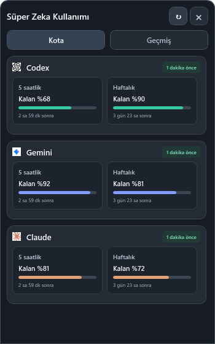
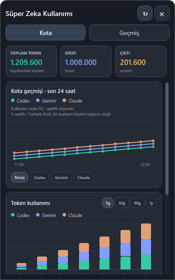

# AI Usage Bar · Süper Zeka Kullanımı

**Keep Codex, Gemini and Claude quotas in sight without leaving your work.**

[Download for Windows x64](https://github.com/kutsaltotem/codex-usage-monitor/releases/latest) · [Türkçe](README.md)


A compact indicator inside your Windows taskbar, next to the system tray. Click once for remaining quotas and reset times. Browse quota trends and optional local token history in the same panel.

 

**Screenshots use synthetic sample values rendered by the current Windows app. They do not show personal accounts or verify a live paid Claude connection. The UI currently uses Turkish.**

## Built for a quick glance

- Three centered brand indicators, readable percentage capsules and a transparent outer background.
- A connected popup: no extra taskbar button, no gap. A second click or switching apps closes it.
- Honest data age: “1 minute ago” refers to the last successful observation, and stale readings remain marked.
- Quota trend lines with separate All / Codex / Gemini / Claude filters.
- Optional CLI token history with pinned totals, period/provider filters and a collapsed model breakdown.
- Provider-specific warning details instead of a large global error banner.
- Two-minute quota polling; opening the panel does not make another quota request.

## Install

1. Download **CodexUsageMonitor-win-x64.zip** from [Releases](https://github.com/kutsaltotem/codex-usage-monitor/releases/latest) and extract the entire archive.
2. Run **Install.cmd**. It installs per user, adds a Start menu shortcut and starts the app. No administrator rights are required. Alternatively, run **CodexUsageMonitor.exe** directly for portable use.
3. Sign in to Codex or Antigravity. Click the indicator beside the system tray.
4. Enable startup from the tray menu if desired. Local CLI token collection is optional and disabled by default.

The .NET runtime is bundled. Tested on Windows 11 x64. This is an unsigned preview release; ARM64, multiple DPI setups, auto-hide and Explorer restart have not been comprehensively validated. [Installation details](docs/INSTALL.md).

## Support and scope

Codex uses the local Codex application session. Gemini uses the running, signed-in Antigravity local quota service with an existing OAuth fallback. Claude requires a local Claude Code subscription OAuth session; signing in to Claude Desktop alone is insufficient. Free Claude Desktop quota is not connected in this version. Live validation was performed for Codex and Antigravity; paid Claude support remains unverified on a real account.

The taskbar shows **remaining** quota. History charts show **used** five-hour quota, or weekly quota when the five-hour window is unavailable. The last24hours label refers to observation times, not total consumption during that day. Antigravity's separate Claude/GPT group is not a Claude Code subscription. Token history only covers supported local CLI logs; it is not subscription usage or a bill.

Quota snapshots and optional token summaries stay under `%LOCALAPPDATA%\CodexUsageMonitor`. Conversation text is not stored in the aggregate history. No analytics server receives your usage history; provider quota calls use your existing session. Credentials are not written into app history. The app does not refresh provider sessions.

WPF has a memory cost: short local observations were roughly160–195MiB working set, not a controlled benchmark. Rendering is deferred and hidden panel visuals are released. Software rendering trades memory for CPU work.

## Build

```powershell
dotnet run --project windows-app/UsageMonitor.Windows/UsageMonitor.Windows.csproj
.\scripts\publish-windows.ps1
```

Requires Windows and .NET10SDK. See the [verification report](WINDOWS-VERIFICATION-20261006.md). Provider endpoints and session formats are unofficial and may change.

Independent project. Not affiliated with or endorsed by OpenAI, Google or Anthropic. Brand assets belong to their respective owners.
